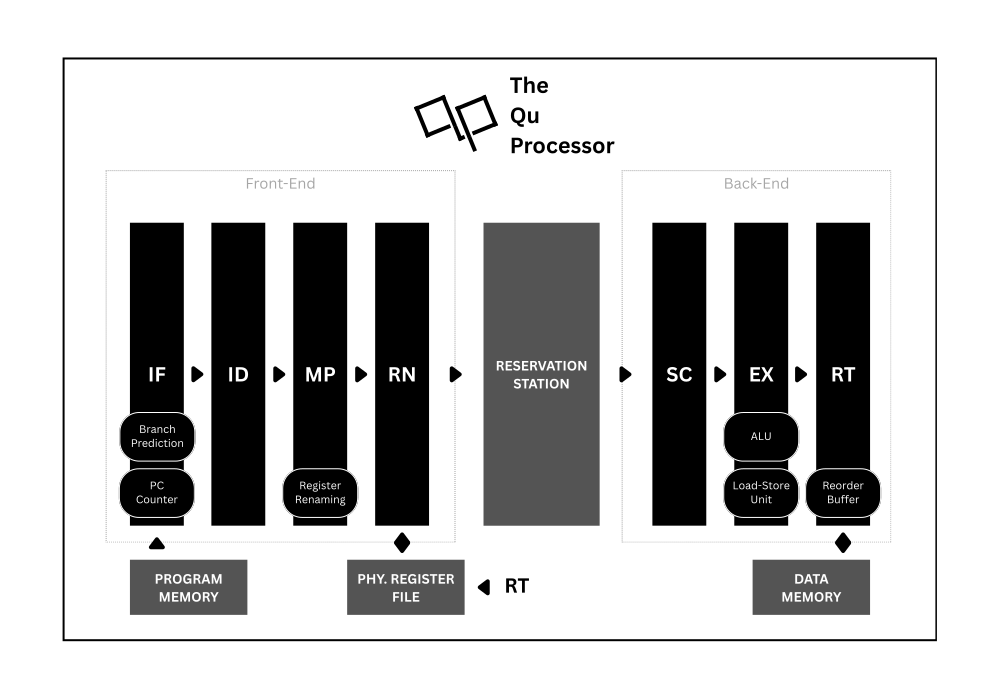

<picture>
  <source
    srcset="docs/qu_banner_dark.svg"
    media="(prefers-color-scheme: dark)"
  />
  <source
    srcset="docs/qu_banner_light.svg"
    media="(prefers-color-scheme: light), (prefers-color-scheme: no-preference)"
  />
  
</picture>  

The Qu Processor is a 32-bit RISC-V CPU designed in SystemVerilog with a superscalar, out-of-order, and speculative execution pipeline. It is loosely based on Apple's Firestorm/Icestorm microarchitecture from M1 series processors. The Qu Processor is intended as an educational endeavor for a better understanding of modern processor architectures beyond simpler beginner-level undertakings.

<picture>
  <source
    srcset="docs/qu_architecture_dark.svg"
    media="(prefers-color-scheme: dark)"
  />
  <source
    srcset="docs/qu_architecture_light.svg"
    media="(prefers-color-scheme: light), (prefers-color-scheme: no-preference)"
  />
  
</picture>  

## Key Specs

  

- Seven-stage superscalar pipeline loosely based on Apple Firestorm/Icestorm
- Speculative out-of-order execution for better performance
- Configurable-sized reservation station, reorder buffer, physical register file, and memory
- RISC-V instruction set architecture (RV32I v2.1)
- Helpers to run custom Assembly (or C) applications on the design

## Project Structure

- `docs/` - Project documentation, specifications, and images
- `hdl/` - Hardware description of The Qu Processor
  - `hdl/lib/` - Libraries for common parameters, functions, tasks, etc.
  - `hdl/rtl/` - RTL source
  - `hdl/sim/` - Testbenches
- `sw/` - Software tools
- `ut/` - Unit tests

## Architecture

The Qu Processor has a seven-stage superscalar out-of-order instruction pipeline. These seven stages are:

##### Fetch (IF)

Fetch stage reads instructions from the program memory, and is basically the receiving end of the pipeline for the instructions. This stage includes program counter and branch prediction logic. **An elaborate branch prediction logic is yet to be implemented. In the current implementation, the processor continues fetching subsequent instructions, which is equivalent to branches being predicted as not taken by default.**

##### Decode (ID)

Decode stage analyzes the incoming instruction, and converts it to a format (micro-op) in a way that makes processing easier in the following stages.

##### Map (MP)

Map stage performs register renaming to handle WAR and WAW hazards. This is the stage where logical registers of the ISA are mapped to the physical registers of the microarchitecture.

##### Rename (RN)

Rename stage allocates a reservation station entry and a reorder buffer entry for the instruction in process. The instruction is then saved to the reservation station to be read from the back-end.

##### Schedule (SC)

Schedule stage reads from the reservation station in batches. It then passes them through based on what type they are or whether they have their source operands ready for use. For faster operation, schedule stage may choose to change the order of the instructions, which is the very thing that makes the microarchitecture "out-of-order".

##### Execute (EX)

Execute stage consists of an arithmetic logic unit and a load-store unit that can be utilized in parallel by two different in-flight instructions. This separation is thought to fast-track load-store instructions, which usually have a longer completion time due to memory access latency.

##### Retire (RT)

Retire stage is where instructions are "committed" in-order, which means that they are finally granted permission to update the state elements existent in the computing system, such as the physical registers and the memory. However, they might also be flushed in case of a mispredicted branch, unconditional jump, or exception.

## Resources

##### [The RISC-V Instruction Set Manual Volume I: Unprivileged ISA](https://riscv.org/specifications/ratified/)

The official, ratified, up-to-date RISC-V ISA specification, describing the RISC-V unprivileged architecture.

##### [Computer Architecture, Sixth Edition: A Quantitative Approach](https://dl.acm.org/doi/book/10.5555/3207796)

An essential reading on computer architecture from Turing award winner scholars John L. Hennessy and David A. Patterson.

##### [AArch64-Explore](https://github.com/name99-org/AArch64-Explore)

A comprehensive research project focused on reverse-engineering and analyzing Apple's M1 processor.

##### [Apple Microarchitecture Research by Dougall Johnson](https://dougallj.github.io/applecpu/firestorm.html)

An attempt at microarchitecture documentation for the CPU in the Apple M1 by Dougall Johnson.

## Status

All instructions of the RV32I ISA v2.1 except ecall, ebreak, and fence are implemented and tested. 

### Next Steps

- 🚧 RV32I instructions ecall, ebreak, and fence
- 🚧 ISA extensions Zicsri and Zifencei
- 🚧 Full verification and compliance tests
- 🚧 Elaborate branch prediction

## Contributing

All types of contributions (pull requests, issues, etc.) are welcome and encouraged.

## License

The Qu Processor is licensed under the MIT License. See [LICENSE](LICENSE) for details.

---